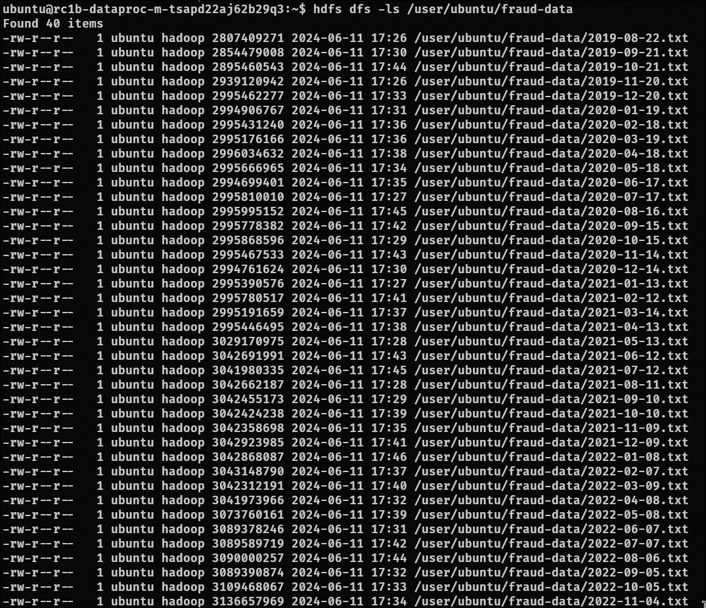

## 1. Содержимое бакета

- Публичная точка доступа к бакету: [https://storage.yandexcloud.net/ducket](https://storage.yandexcloud.net/ducket)
## 3. Копирование данных в HDFS

## 4. Оценка затрат
### Таблица тарифов на дисковые хранилища (SSD/HDD)

| Тип диска                      | Цена за 1 ГБ, ₽ |
|--------------------------------|----------------|
| Быстрый диск (SSD)             | 11,91          |
| Стандартный диск (HDD)         | 2,92           |
| Нереплицируемый диск (SSD)     | 8,80           |
| Высокопроизводительный диск (SSD) | 19,80       |

### Таблица тарифов на объектные хранилища (S3)

| Тип хранилища                  | Цена за 1 ГБ, ₽ |
|--------------------------------|----------------|
| Стандартное хранилище          | 2,01           |
| Холодное хранилище             | 1,07           |
| Ледяное хранилище              | 0,535          |

- Общая стоимость кластера без публичного доступа: **25891,2 ₽/месяц**
- Средняя цена HDFS-хранилища дороже средней цены объектного в **9,0104** раза

## 5. Оптимизация затрат

- Использовать ледяное хранилище для данных с редким доступом
- Использовать HDD для данных с частым доступом
- Использовать нереплицируемый SSD, если возможно повторный скачивание и данные не имеют высокой ценности
- Снизить гарантированную долю vCPU до 20%
- Использовать прерывающиеся виртуальные машины
- Посмотреть список доступых льгот
